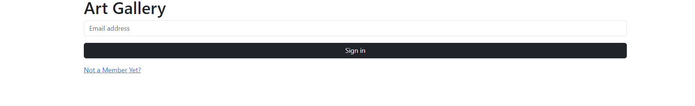
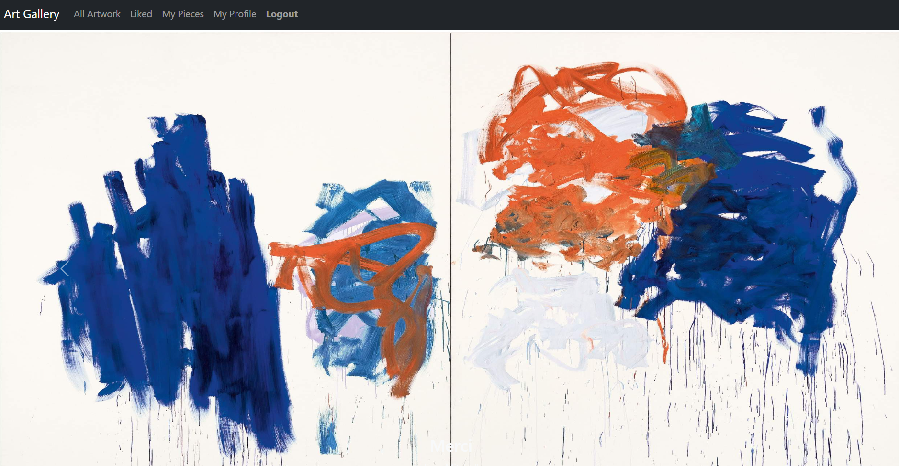
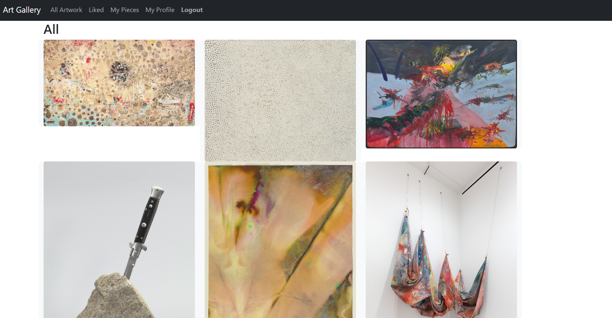
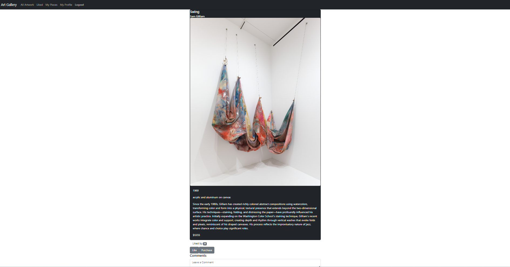
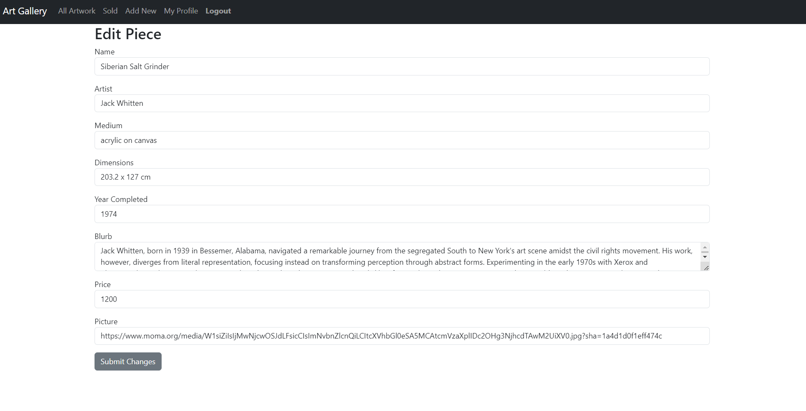
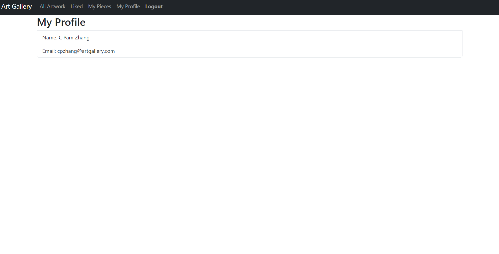

# Art Gallery

## Walkthrough

### Login/Register

### Dashboard

### All Pieces

### Piece Details

### Edit Details

### My Profile

## Install

1. Clone down the repository
2. In the root folder of the project run `npm install`
3. Install JSON-Server `npm i -g serve json-server`
4. In api folder, run `json-server database.json -p 8088`
5. In root folder, run `npm run dev`
